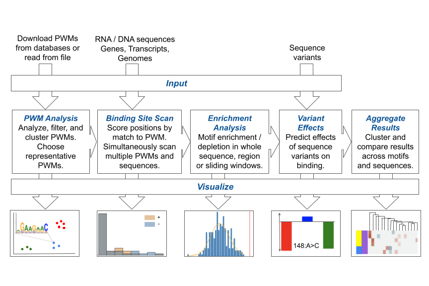

# SMEAGOL (Sequence Motif Enrichment And Genome annOtation Library)

SMEAGOL is a library to identify and visualize enrichment (or depletion) of sequence motifs in DNA/RNA sequences.



## Setup

It is recommended to install SMEAGOL in a conda environment or virtualenv. SMEAGOL is compatible with Python 3.7 and higher.

If you have conda installed on your machine you can create a conda environment like this:
```
conda create --name SMEAGOL python=3.7
```

Next, you need to activate the created environment before you can install SMEAGOL into it, which can be done as follows:

```
conda activate SMEAGOL
```

### 1. Clone this git repository
```
git clone https://github.com/gruber-sciencelab/SMEAGOL && cd SMEAGOL
```

### 2. Install SMEAGOL
```
pip install .
```
Or, if you want to edit the code:
```
pip install -e .
```

### 3. Run tests locally (optional)
```
cd tests
pytest
```

### 4. Install jupyter lab and add SMEAGOL kernel to Ipython (if running SMEAGOL in Jupyter notebooks)
```
pip install jupyterlab 
python -m ipykernel install --user --name=SMEAGOL --display-name='Python 3.7 (SMEAGOL)'
```

## Usage

In your python script / notebook, you can import modules or functions from SMEAGOL. For example:
```
import smeagol.visualize
```
```
from smeagol.visualize import plot_background
```

## Modules

The following modules are included:

- smeagol.aggregate: Aggregate results across different genomes.
- smeagol.encode: Encoding nucleic acid sequences into numeric form for PWM scanning.
- smeagol.enrich: Calculate enrichment or depletion of PWM matches in a sequence.
- smeagol.io: Read and write data (motifs and sequences).
- smeagol.matrices: Analyze motifs in the form of PFMs, PPMs and PWMs.
- smeagol.models: Encoding of PWMs into a model to scan sequences.
- smeagol.scan: Scan nucleic acid sequences with PWMs and score putative binding sites.
- smeagol.utils: Miscellaneous functions used by other modules.
- smeagol.variant: Predict the effects of sequence variants on the PWM match score.
- smeagol.visualize: Generating visualizations.

## Documentation
https://gruber-sciencelab.github.io/SMEAGOL/

## Tutorials

See the [vignette](vignette_1.ipynb) for an example workflow using SMEAGOL.

## Citation

Please cite our [publication](https://www.mdpi.com/1999-4915/14/7/1436): Lal, A., Galvao Ferrarini, M., & Gruber, A. J. (2022). Investigating the Human Host—ssRNA Virus Interaction Landscape Using the SMEAGOL Toolbox. Viruses, 14(7), 1436.
